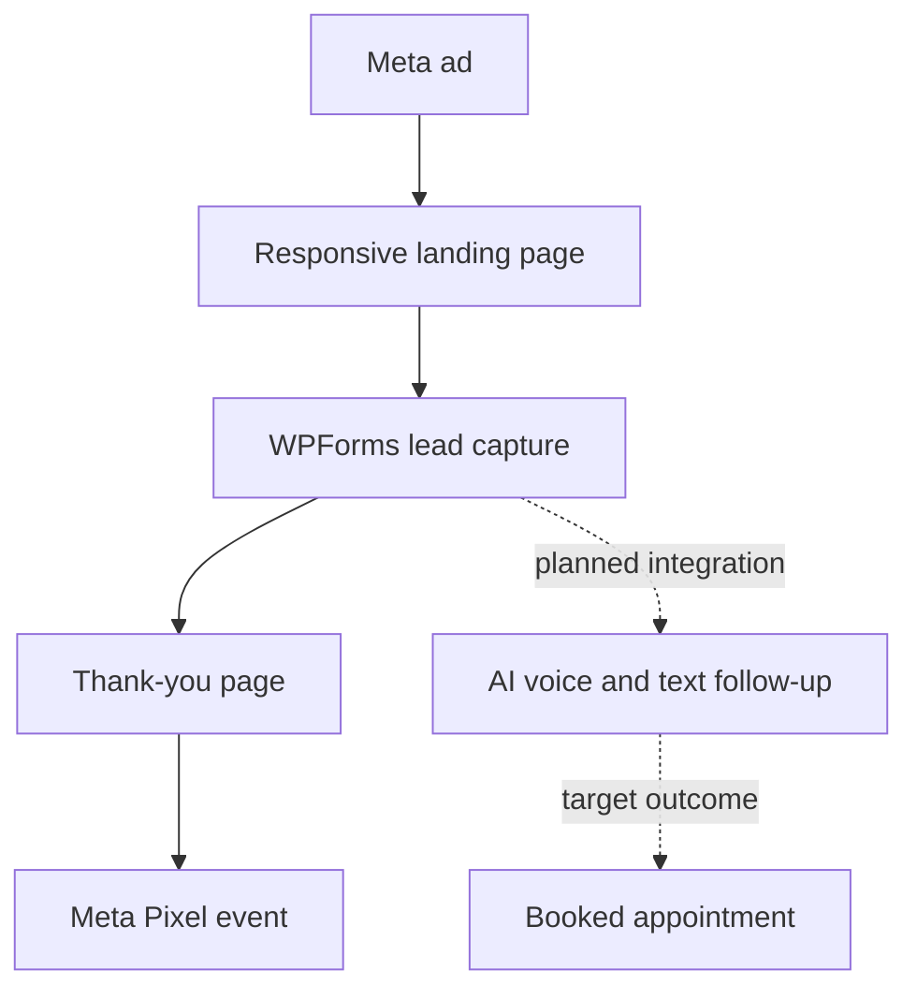
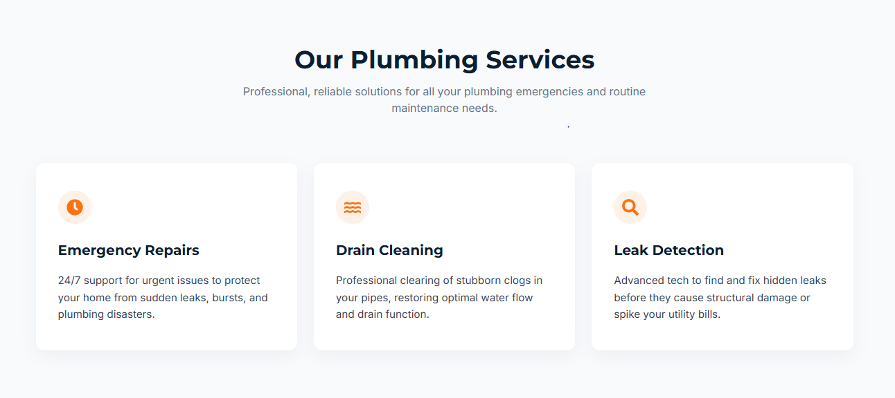
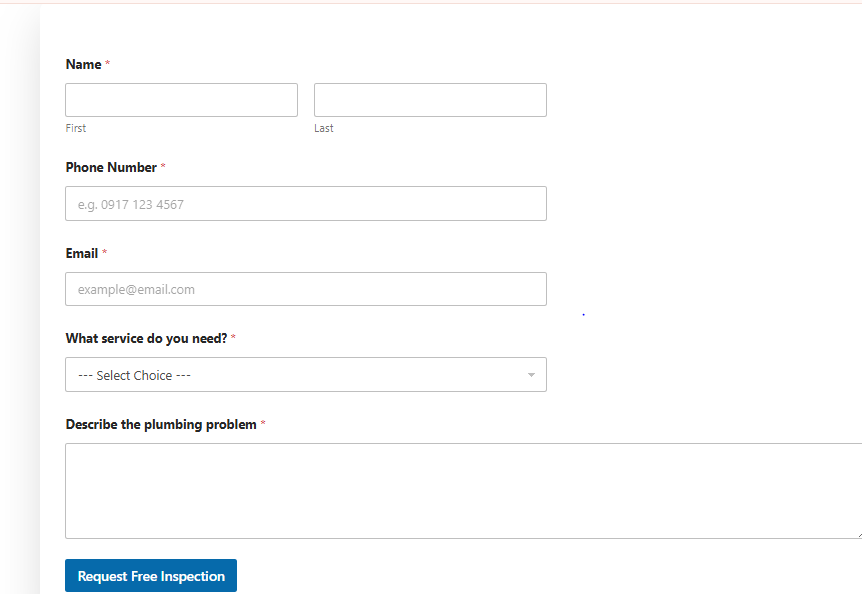
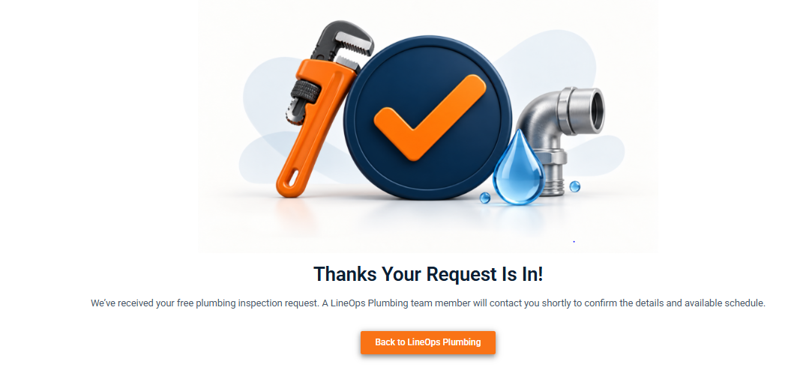

# LineOps Emergency Plumbing Lead Generation System

A conversion-focused portfolio prototype for residential and emergency plumbing services. The project demonstrates how paid traffic can move through a clear landing-page journey, structured lead capture, conversion tracking, and an AI-assisted follow-up concept.

> **Project status:** Working portfolio prototype. The WordPress landing page and form journey were completed and tested locally. The Meta Pixel loads in the browser, but public-domain event verification is still pending. The AI receptionist was tested separately and is not yet connected to the live funnel.

## Business problem

Emergency plumbing leads are time-sensitive. A missed call, confusing mobile page, or slow response can turn a high-intent visitor into a lost job. LineOps focuses on one measurable outcome: make it easy for a homeowner to request an inspection and preserve the lead for follow-up.

## Funnel architecture

## Core offer

**Pain-point angle**

> Tired of that dripping faucet keeping you up at night?
>
> Small leaks today become expensive repairs tomorrow. Free inspections this month.

**Primary CTA:** Book Free Inspection

## What I built

- Responsive WordPress landing page using Elementor
- Conversion-focused hero, trust points, and plumbing service cards
- Anchored CTA that scrolls directly to the booking form
- WPForms inspection-request form
- Dedicated thank-you page and return-to-LineOps action
- Meta Pixel installation and browser-level loading check
- Separate AI receptionist demonstration using voice/text tooling and Twilio code
- Desktop and mobile layout refinements to remove overflow and improve tap targets

## Project screens

### Landing-page hero

### Services

### Booking section

### Lead-capture form

### Thank-you page

## Tools and platforms

| Area | Tools |
| --- | --- |
| Landing page | WordPress, Elementor |
| Lead capture | WPForms |
| Paid traffic concept | Meta Ads |
| Tracking | Meta Pixel; Conversions API planned |
| Follow-up concept | AI voice/text receptionist, Twilio demo |
| Local development | LocalWP and Local Live Link |

## Demonstrated behavior

- The landing page renders as a complete desktop experience.
- Responsive layouts were refined for tablet and mobile widths.
- The main CTA scrolls to the booking section through the `#booking` anchor.
- The form submits to a dedicated thank-you page.
- The return action on the thank-you page routes back to LineOps.
- The Meta Pixel base function and configured Pixel ID were detected in the browser.

## Current limitations

- LocalWP Live Link is temporary and password-protected; it is not a production hosting setup.
- Meta Events Manager public-domain activity has not yet been verified.
- Conversions API is planned but not implemented.
- The AI receptionist demo is separate from the WordPress submission flow.
- No client performance metrics, ad spend, booked-job revenue, or production conversion rate are claimed.

## Recommended production path

1. Move the site to a permanent HTTPS domain.
2. Connect the final domain in Meta Business tools.
3. Verify `PageView`, `Lead`, and thank-you-page events.
4. Add Conversions API with deduplication.
5. Connect WPForms to the CRM or automation workflow.
6. Trigger immediate SMS/voice follow-up with consent and human escalation.
7. Run end-to-end tests before launching paid traffic.

More detail is available in [implementation notes](docs/implementation-notes.md) and the [testing checklist](docs/testing-checklist.md).

## Author

**Alejandro Lim**  
AI Automation Specialist · Frontend and workflow integration  
[GitHub](https://github.com/alejandrolim07-droid) · [LinkedIn](https://linkedin.com/in/alejandro-lim-7648a32a9)

